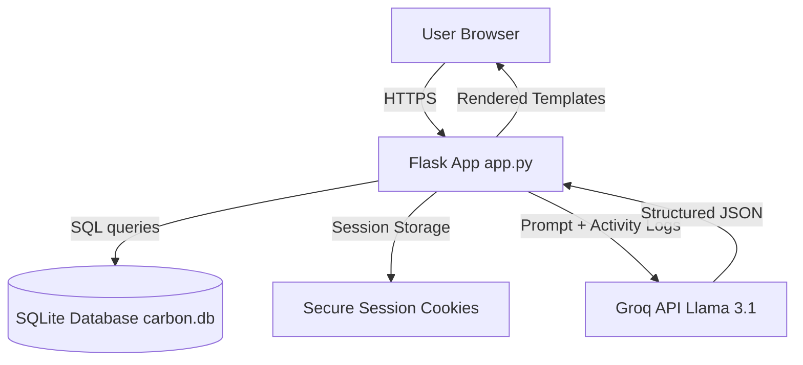

# Building an AI-Powered Carbon Footprint Awareness Platform with Flask, SQLite, and Groq (Llama 3.1)

## 🌿 Introduction
As climate awareness grows, individuals are looking for actionable ways to reduce their personal carbon footprints. However, most carbon calculators are either too complex or offer generic, unhelpful advice. 

To solve this, I built **CarbonWise**—a production-ready Carbon Footprint Awareness Platform. It combines deterministic scientific carbon calculations with real-time, personalized AI reduction strategies using the Groq LLM API. 

Here is a technical deep-dive into how I built, secured, and optimized this application for the **PromptWars: Virtual** challenge.

---

## 🏗️ Architecture & System Design
The application is designed to be lightweight, secure, and highly performant, avoiding heavy framework overhead:



1. **Backend**: Flask (Python) handles routing, user session state, and database operations.
2. **Database**: SQLite manages users and logs. We activated WAL (Write-Ahead Logging) mode to enable concurrent reads and writes.
3. **AI Engine**: Connects to the Groq API using the ultra-fast Meta **Llama 3.1 8B** model (`llama-3.1-8b-instant`).
4. **Frontend**: Rendered server-side with Jinja2 templates and styled with a custom dark-mode glassmorphism design system in Vanilla CSS.

---

## ⚙️ Feature Deep-Dive

### 1. Deterministic Carbon Calculations (`carbon_engine.py`)
To prevent calculation drift, the engine uses fixed conversion factors for logging three main categories:
* **Travel**: Car (`0.21` kg/km), Motorbike (`0.05` kg/km), Bus (`0.08` kg/km), and Flight (`0.255` kg/km).
* **Food**: Vegetarian meal (`0.5` kg/meal) and Non-vegetarian meal (`2.5` kg/meal).
* **Energy**: Electricity (`0.82` kg/kWh).

```python
def calculate_co2(activity_type: str, quantity: float) -> float:
    if activity_type not in EMISSION_FACTORS:
        raise ValueError(f"Unknown activity type '{activity_type}'")
    if quantity <= 0:
        raise ValueError("Quantity must be positive")
    return round(EMISSION_FACTORS[activity_type] * quantity, 4)
```

### 2. Structured AI Insights & Session Caching (`ai_engine.py`)
To keep the dashboard fast and prevent redundant external HTTP calls, I implemented a session caching mechanism:
* When a user loads the dashboard, the platform checks if AI insights are cached in the session.
* If missing, it requests insights from the Groq API.
* The system enforces a strict JSON schema output from the model: `summary`, `top_emission_sources`, `suggestions` (3–5 tips), `eco_score` (0–100), and `motivation`.
* When the user logs a new activity in `/log`, the cache is invalidated so the dashboard gets fresh insights on the next load.

```python
# Check session cache
insights = session.get("ai_insights")
if not insights:
    all_acts = _get_all_activities_7days(user_id)
    insights = get_ai_insights(all_acts, daily_total, category_breakdown)
    session["ai_insights"] = insights
```

### 3. Fortified Security & Defense in Depth
* **Passwords**: Encrypted using PBKDF2-SHA256 password hashing through Werkzeug.
* **SQL Injection Prevention**: All SQLite queries are fully parameterized.
* **XSS & Clickjacking Protection**: Injected security headers into every HTTP response:
  * `X-Content-Type-Options: nosniff`
  * `X-Frame-Options: DENY`
  * `X-XSS-Protection: 1; mode=block`
  * `Referrer-Policy: strict-origin-when-cross-origin`
  * `Content-Security-Policy` (CSP) restricting assets to `'self'` and specific secure fonts.
* **Session Cookies**: Locked with `Secure`, `HttpOnly`, and `SameSite='Lax'` flags.

### 4. WCAG AA Accessibility Compliance
* Wrapped all visual emojis in `<span role="img" aria-label="...">` tags for screen-reader compatibility.
* Added a `.sr-only` class to visually hide labels while exposing them to accessibility scanners.
* Ensured every page has exactly one prominent `<h1>` header.
* Increased the brightness of text variables to meet the WCAG AA contrast ratio threshold of `4.5:1` on dark backgrounds.

---

## 🧪 Testing & Verification
I built a comprehensive test suite in `tests/test_app.py` containing **47 total assertions** across five key test domains:
1. **`test_carbon_calculation`**: Asserts deterministic conversion factors.
2. **`test_api_response`**: Asserts HTTP route statuses (200, 302 redirects) for both authenticated and guest states.
3. **`test_ai_json_structure`**: Verifies parser fallback behavior, JSON key validation, and markdown fence-stripping.
4. **`test_login`**: Tests registration, hashing verification, and correct login redirection.
5. **`test_input_validation`**: Rejects invalid types, zero quantities, empty inputs, and non-numeric strings.

```bash
pytest tests/test_app.py -v
# Output: 47 passed in 32.70s
```

---

## 💡 Lessons Learned from vibe coding with Google Antigravity
Building this platform with **Google Antigravity** shifted my focus from syntax debugging to high-level intent design. 
* **Rapid Prototyping**: Iterating on the dark glassmorphism design system took minutes instead of hours.
* **Continuous Refactoring**: Safely adding security headers, accessibility properties, and session caching was completed quickly while maintaining a clean git commit history.
* **Production Focus**: Allowed me to focus on writing thorough tests and setting up Gunicorn deployment configurations.

The resulting codebase is performant, accessible, secure, and ready to scale. Let's make the web a greener place! 🌿
